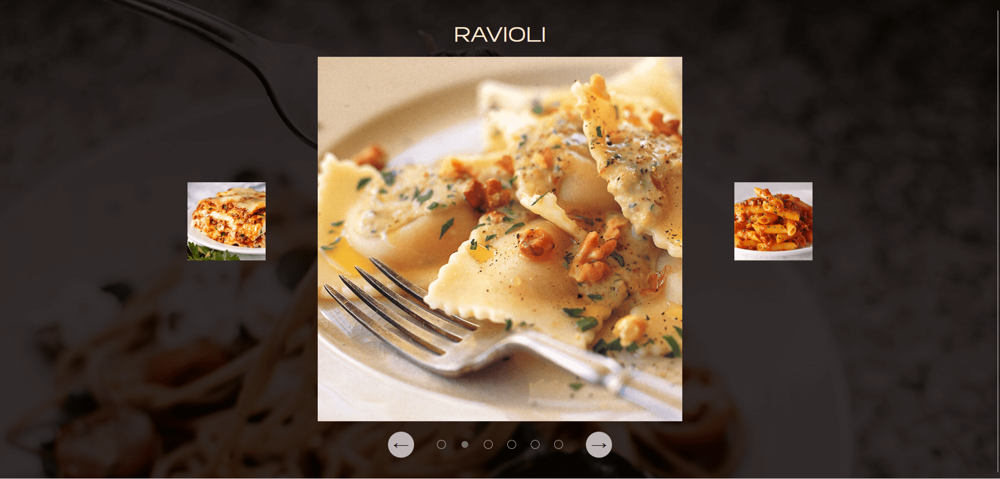

# Pasta Carousel

This project is a dynamic image carousel showcasing various recipes. It features an intuitive navigation system and a sleek, responsive design. The carousel allows users to browse through different recipes, each displayed with an image and its name. 

## Key Features

- **Carousel Navigation**: Users can navigate through the recipes using next/previous buttons or by clicking on the dots representing each recipe.
- **Auto-Slideshow**: The carousel automatically advances to the next recipe every few seconds.
- **Responsive Design**: The layout is fully responsive, ensuring a great user experience on both desktop and mobile devices.
